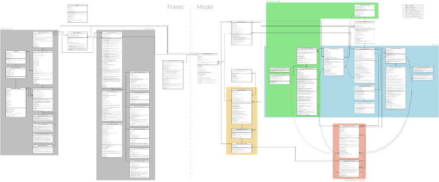

<!--
  SPDX-FileCopyrightText: Acclimate authors

  SPDX-License-Identifier: AGPL-3.0-or-later
-->

[](http://dx.doi.org/10.5281/zenodo.853346)


# Acclimate - a model for economic loss propagation

C++11-Implementation of the Acclimate model by [Sven Willner](https://github.com/swillner) and [Christian Otto](https://github.com/cstotto).


## Description / Citation

The newest ("price") version of the Acclimate model is described in (please cite when using this code):

- Otto C, Willner SN, Wenz L, Frieler K, Levermann A. (2017).
  **[Modeling loss-propagation in the global supply network:
  The dynamic agent-based model acclimate](http://www.pik-potsdam.de/~willner/files/otto-willner17.pdf)**.
  Journal of Economic Dynamics and Control.
  doi:[10.1016/j.jedc.2017.08.001](http://dx.doi.org/10.1016/j.jedc.2017.08.001).


## Class diagram

[](./figures/class_diagram.png)


## Dependencies

You need to have [CMake](https://cmake.org/) installed for compiling the source code (under Ubuntu-like Linux distributions: `sudo apt-get install cmake`).

External dependecies:

- [NetCDF C](https://www.unidata.ucar.edu/software/netcdf)
  - used for reading and writing of NetCDF files
  - Source code: [Unidata/netcdf-c](https://github.com/Unidata/netcdf-c)
- [NLOpt](http://ab-initio.mit.edu/wiki/index.php/NLopt)
  - used for numerical optimization
  - will be built in by default
  - Source code: [stevengj/nlopt](https://github.com/stevengj/nlopt))
- [YAML-cpp](https://github.com/jbeder/yaml-cpp)
  - used for reading settings files
  - will be built in by default
  - Source code: [jbeder/yaml-cpp](https://github.com/jbeder/yaml-cpp)

Further built-in dependecies (included in this repository as subtrees):

- [swillner/cmake-modules](https://github.com/swillner/cmake-modules)
  - used for compilation
- [swillner/cpp-library](https://github.com/swillner/cpp-library)
  - some minor helper functions, e.g. for progress bar
- [swillner/netcdfpp](https://github.com/swillner/netcdfpp)
  - used for reading and writing NetCDF files
- [swillner/settingsnode](https://github.com/swillner/settingsnode)
  - used for reading settings files


## How to build

Have a look at the [CMake](https://cmake.org/) documentation of how to invoke CMake on your system. On a system using the `make` command, simply run:

```
mkdir build
cd build
cmake ..
make
```

Further configuration can be done before running `make` e.g. using `ccmake ..`.


## Usage

Multi-regional input-output is used by Acclimate to build-up the baseline economic network. Such data is not included in this repository. In the publications mentioned above the [EORA](http://worldmrio.com) dataset was used.

Acclimate expects a configuration [YAML](http://yaml.org) file whose path is given on the commandline when running Acclimate. An example is provided in `example/settings.yml`.

For information about the built binary run:

```
./acclimate -i
```


## Old model versions

This implementation also includes the older "basic" and "demand" versions. These are described in:

- Bierkandt R, Wenz L, Willner SN, Levermann A. (2014).
  **[Acclimate - a model for economic damage propagation. Part I: basic
  formulation of damage transfer within a global supply network and
  damage conserving dynamics](http://www.pik-potsdam.de/~anders/publications/bierkandt_wenz14.pdf)**.
  Environment Systems and Decisions, 34, 507-524.
  doi:[10.1007/s10669-014-9523-4](http://dx.doi.org/10.1007/s10669-014-9523-4).
- Wenz L, Willner SN, Bierkandt R, Levermann A. (2014).
  **[Acclimate - a model for economic damage propagation. Part II: a
  dynamic formulation of the backward effects of disaster-induced
  production failures in the global supply network](http://www.pik-potsdam.de/~anders/publications/wenz_willner15.pdf)**.
  Environment Systems and Decisions, 34, 525-539.
  doi:[10.1007/s10669-014-9521-6](http://dx.doi.org/10.1007/s10669-014-9521-6).
